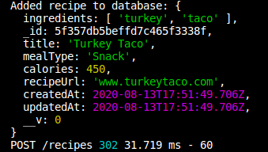

# Medium Difficulty
# 
# Step-By-Step Instructions (with some code):
## <br>
### Step 1:  Navigate to the parent directory where you want to create your app.  Use the express generator to create your app's skeleton:
```
npx express-generator -e recipe-retriever
```
### <br>
### Step 2: Navigate into the directory and open in VS Code:
### <br>
### Step 3:  Open a terminal in VS Code.  Change the name of app.js to server.js:
### <br>
### Step 4:  Adjust the /bin/www file to reflect those changes so that your server will start properly:
```js
// Change var app = require('../app'); to:
var app = require('../server');
```
### <br>
### Step 5:  Create directories for the model, controller, database (config), and views, then add the corresponding files within each:
### <br>
### Step 6:  Install Node modules and mongoose using npm:
```
npm install
npm install mongoose
```
### <br>
### Step 7:  Split the terminal at the bottom of VS Code to open a second window for monitoring the server.  Start the server using nodemon and test it out:
### When you browse to 'localhost:3000' you should see the generic express template.
## <br>
### Step 8:  Configure the database connection in database.js:
```js
const mongoose = require('mongoose');

mongoose.connect('mongodb://localhost/recipes',
    {useNewUrlParser: true, useCreateIndex: true, useUnifiedTopology: true}
);

const db = mongoose.connection;
 
db.on('connected', function() {
    console.log(`Connected to MongoDB at ${db.host}:${db.port}`);
});
```
### <br>
### Step 9:  Require the database in server.js (put it near the top!):
```js
require('./config/database');
```
### <br>
### Step 10:  Define the schema in the model (recipe.js):
```js
var mongoose = require('mongoose');
var Schema = mongoose.Schema;

var recipeSchema = new Schema({
    title: {type: String, required: true},
    calories: {type: Number},
    mealType: {type: String, enum: ['Snack', 'Breakfast', 'Lunch', 'Dinner', 'Dessert']},
    recipeUrl: {type: String},
    ingredients: [String]
}, {
    timestamps: true
   }
);

module.exports = mongoose.model('Recipe', recipeSchema);
```
### <br>
### Step 11:  Use the terminal to rename users.js --> recipes.js:
### <br>
### Step 12:  Adjust server.js to reflect the changes from the previous step:
### <br>
### Step 13:  Define a route for the index page in routes/recipes.js  (replace the existing code):
```js
router.get('/', recipesCtrl.index);
```
### <br>
### Step 14:  Add the corresponding controller in controllers/recipes.js:
```js
function index(req, res){
    Recipe.find({})
    .then((recipes) => {
        res.render('recipes/index', { recipes })
    })
}

```
### <br>
### Step 15:  Use the terminal to create an index view:
### <br>
### Step 16:  Add a button to add, along with a simple table using ejs in the newly created index.ejs:
```html
<!DOCTYPE html>
<html lang="en">
<head>
    <meta charset="UTF-8">
    <meta name="viewport" content="width=device-width, initial-scale=1.0">
    <link rel='stylesheet' href='/stylesheets/style.css' />
    <link rel="stylesheet" href="https://stackpath.bootstrapcdn.com/bootstrap/4.3.1/css/bootstrap.min.css" integrity="sha384-ggOyR0iXCbMQv3Xipma34MD+dH/1fQ784/j6cY/iJTQUOhcWr7x9JvoRxT2MZw1T" crossorigin="anonymous">
    <title>Recipe Retriever</title>
</head>
<body>
    <h2>Recipe List</h2><br>
    <table id="recipeList">
        <thead>
            <tr>
                <th>Recipe</th>
                <th>Meal<br>Type</th>
                <th>Recipe<br>URL</th>
            </tr>
        </thead>
        <tbody>
            <% recipes.forEach(function(recipe) { %>
                <tr>
                    <td><%= recipe.title %></td>
                    <td><%= recipe.mealType %></td>
                    <td><a href="http://<%= recipe.recipeUrl %>">See Recipe</a></td>
                    <td><a href="/recipes/<%= recipe._id %>">Details</a></td>
                </tr>
            <% }) %>
        </tbody>
    </table>
    <a href="/recipes/new">Add Recipe</a>
</body>
</html>
```
### <br>
### Step 17:  Add some CSS to make it look a little nicer:
```css
table thead th {
  padding: 5px;
  border-bottom: 2px solid #424748;
}

table td {
  padding: 10px;
  text-align: center;
}

#recipeList td:nth-child(2), #recipeList td:nth-child(3){
  min-width: 100px;
}
```
### <br>
### Step 18:  Change the default 'localhost:3000' landing page to redirect to 'localhost:3000/recipes'.  Do this by changing the route in routes/index.js:
```js
router.get('/', function(req, res) {
  res.redirect('/recipes')
});
```
### <br>
### Step 19:  Configure your router in recipes.js and define a route to create a new recipe:
```js
var express = require('express');
var router = express.Router();
var recipesCtrl = require('../controllers/recipes');

router.get('/new', recipesCtrl.new);

module.exports = router;
```
### <br>
### Step 20:  Add the controller in controllers/recipes.js:
```js
var Recipe = require('../models/recipe');

module.exports = {
    new: newRecipe
}

function newRecipe(req, res) {
    res.render('recipe/new');
}
```
### <br>
### Step 21:  Create a view page for adding a recipe:
### <br>
### Step 22:  Create a form within new.ejs for the user to add an item:
```html
<!DOCTYPE html>
<html lang="en">
<head>
    <meta charset="UTF-8">
    <meta name="viewport" content="width=device-width, initial-scale=1.0">
    <link rel='stylesheet' href='/stylesheets/style.css' />
    <link rel="stylesheet" href="https://stackpath.bootstrapcdn.com/bootstrap/4.3.1/css/bootstrap.min.css" integrity="sha384-ggOyR0iXCbMQv3Xipma34MD+dH/1fQ784/j6cY/iJTQUOhcWr7x9JvoRxT2MZw1T" crossorigin="anonymous">
    <title>Recipe Retriever</title>
</head>
<body>
    <h2>Enter new recipe:</h2><br>
    <form action="/recipes" method="POST">
        <label>Recipe Name:
            <input type="text" name="title">
        </label><br><br>
        <label>Meal Type (select one):
            <select name="mealType">
                <option value="Snack">Snack</option>
                <option value="Breakfast">Breakfast</option>
                <option value="Lunch">Lunch</option>
                <option value="Dinner">Dinner</option>
                <option value="Dessert">Dessert</option>
            </select>
        </label><br><br>
        <label>Calories (per serving):
            <input type="text" name="calories">
        </label><br><br>
        <label>Ingredients (separate each with a comma):
            <textarea id="ingredientBox" rows="1" type="text" name="ingredients"></textarea>
            </label><br><br>
        <label>Link to recipe:
            <input id="urlInput" type="text" name="recipeUrl">
        </label><br><br>

        <button type="submit" class="btn btn-success">Add</button>
    </form>
</body>
</html>
```
### <br>
### Step 23:  Add minimal CSS in public/stylesheets/style.css:
```css
#ingredientBox {
  width: 250px;
}

#ingredientBox:focus {
  height: 100px;
}

#urlInput {
  width: 430px;
}
```
### <br>
### Step 24:  Define the POST route in routes/recipes.js:
```js
router.post('/', recipesCtrl.create);
```
### <br>
### Step 25:  Create a controller for the route in controllers/recipes.js:
```js
module.exports = {
    new: newRecipe,
    create
}
...
...
...

function create(req, res) {
    req.body.ingredients = req.body.ingredients.replace(/\s*,\s*/g, ',');
    if (req.body.ingredients) req.body.ingredients = req.body.ingredients.split(',');
    Recipe.create(req.body)
    .then((recipe) => {
        console.log('Added recipe to database:', recipe);
        res.redirect('/recipes')
    })
}
```
### Step 26:  Navigate to the new recipe page, fill out the fields, and hit the 'Add' button.  Check to make sure the POST request shows up in the terminal currently running the server:

### <br>
### Step 27:  Add a route for the 'Details' button that was just created.  Add the following to routes/recipes.js:
```js
router.get('/:id', recipesCtrl.show);
```
### <br>
### Step 28:  Add the controller for the new route in controllers/recipes.js:
```js
function show(req, res) {
    Recipe.findById(req.params.id)
    .then((recipe) => {
        res.render('recipes/show', { recipe })
    })
}
```
### <br>
### Step 29:  Using the terminal, create a file called show.ejs:
### <br>
### Step 30:  Write the HTML/ejs to display the data for an individual item in show.ejs:
```html
<!DOCTYPE html>
<html lang="en">
<head>
    <meta charset="UTF-8">
    <meta name="viewport" content="width=device-width, initial-scale=1.0">
    <link rel='stylesheet' href='/stylesheets/style.css' />
    <link rel="stylesheet" href="https://stackpath.bootstrapcdn.com/bootstrap/4.3.1/css/bootstrap.min.css" integrity="sha384-ggOyR0iXCbMQv3Xipma34MD+dH/1fQ784/j6cY/iJTQUOhcWr7x9JvoRxT2MZw1T" crossorigin="anonymous">
    <title>Recipe Retriever</title>
</head>
<body>
    <h2>Recipe Details</h2><br>
    <div class="details-bold">Recipe Name:</div>
    <div><%= recipe.title %></div>
    <div class="details-bold">Meal Type:</div>
    <div><%= recipe.mealType %></div>
    <div class="details-bold">Calories:</div>
    <div><%= recipe.calories %></div>
    <div class="details-bold">Ingredients:</div>
    <%= recipe.ingredients.map(i => i).join(', ') %>
    <div class="details-bold">Recipe Link:</div>
    <div><%= recipe.recipeUrl %></div>
</body>
</html>
```
### <br>
### Step 31:  Add some CSS to clean up the display:
```css
.details-bold {
  font-weight: bold;
  text-decoration: underline;
}
```
### <br>
### Step 31.5: Use npm to install the method-override package:
### ...then require it in server.js:
```js
let methodOverride = require('method-override');
```
### ...and add it to the middleware:
```js
app.use(methodOverride('_method'));
```
### <br>
### Step 32:  Add a button to index.ejs to handle deletion:
```html
<tr>
    <td><%= recipe.title %></td>
    <td><%= recipe.mealType %></td>
    <td><a href="http://<%= recipe.recipeUrl %>">See Recipe</a></td>
    <td><a href="/recipes/<%= recipe._id %>">Details</a></td>
    <!-- Add the following form here: -->
    <form action="/recipes/<%= recipe._id %>?_method=DELETE" method="POST">
    <td><button type="submit" class="btn btn-danger">X</button></td>
    </form>
</tr>
```
### <br>
### Step 33:  Add the route to handle deletions in routes/recipes.js:
```js
router.delete('/:id', recipesCtrl.delete);
```
### <br>
### Step 34:  Add the corresponding controller to controllers/recipes.js (don't forget to add it to module.exports!):
```js

module.exports = {
    new: newRecipe,
    create,
    index,
    show,
    // Add this line:
    delete: deleteRecipe
}

function deleteRecipe(req, res) {
    Recipe.findByIdAndDelete(req.params.id)
    .then(res.redirect('/recipes'))
}
```
### <br>
### Step 35:  Add a button in show.ejs to handle updating an item:
```html
<!-- ... -->
<div class="details-bold">Recipe Link:</div>
    <div><%= recipe.recipeUrl %></div>
    <!-- Add the button here: -->
    <form action="/recipes/<%= recipe._id %>/edit">
        <button type="submit" class="btn btn-warning">Edit</button>
    </form>
</body>
```
### <br>
### Step 36:  Add the route to handle showing the update page in routes/recipes.js:
```js
router.get('/:id/edit', recipesCtrl.edit);
```
### <br>
### Step 37:  Add the corresponding controller in controllers/cuisine.js:
```js

module.exports = {
    new: newRecipe,
    create,
    index,
    show,
    delete: deleteRecipe,
    // Add this line:
    edit
}

function edit(req, res) {
    Recipe.findById(req.params.id)
    .then((recipe) => {
        res.render('recipes/edit', { recipe })
    })
}
```
### <br>
### Step 38:  Using the terminal, create a new view called edit.ejs:
### <br>
### Step 39:  Copy the form over from show.ejs to edit.ejs, but modify it to auto-populate the values of each field with the current record's info:
```html
<!DOCTYPE html>
<html lang="en">
<head>
    <meta charset="UTF-8">
    <meta name="viewport" content="width=device-width, initial-scale=1.0">
    <link rel='stylesheet' href='/stylesheets/style.css' />
    <link rel="stylesheet" href="https://stackpath.bootstrapcdn.com/bootstrap/4.3.1/css/bootstrap.min.css" integrity="sha384-ggOyR0iXCbMQv3Xipma34MD+dH/1fQ784/j6cY/iJTQUOhcWr7x9JvoRxT2MZw1T" crossorigin="anonymous">
    <title>Recipe Retriever</title>
</head>
<body>
    <h2>Edit Recipe:</h2><br>
    <form action="/recipes/<%= recipe._id %>?_method=PUT" method="POST">
        <label>Recipe Name:
            <input type="text" name="title" value="<%= recipe.title %>">
        </label><br><br>
        <label>Meal Type (select one):
            <select name="mealType">
                <option selected ><%= recipe.mealType %></option>
                <option value="Snack">Snack</option>
                <option value="Breakfast">Breakfast</option>
                <option value="Lunch">Lunch</option>
                <option value="Dinner">Dinner</option>
                <option value="Dessert">Dessert</option>
            </select>
        </label><br><br>
        <label>Calories (per serving):
            <input type="text" name="calories" value="<%= recipe.calories %>">
        </label><br><br>
        <label>Ingredients (separate each with a comma):
            <textarea id="ingredientBox" rows="1" type="text" name="ingredients"><%= recipe.ingredients.map(i => i).join(', ') %></textarea>
            </label><br><br>
        <label>Link to recipe:
            <input id="urlInput" type="text" name="recipeUrl" value="<%= recipe.recipeUrl %>">
        </label><br><br>
        <button type="submit" class="btn btn-success">Update</button>
    </form>
</body>
</html>
```
### <br>
### Step 40:  Add the POST route to send the record to be updated in routes/recipes.js:
```js
router.put('/:id', recipesCtrl.update);
```
### <br>
### Step 41:  Add the corresponding controller in controllers/recipes.js:
```js
function update(req, res) {
    req.body.ingredients = req.body.ingredients.replace(/\s*,\s*/g, ',');
    if (req.body.ingredients) req.body.ingredients = req.body.ingredients.split(',');
    Recipe.findByIdAndUpdate(req.params.id, req.body, {new: true})
    .then((recipe) => {res.redirect(`/recipes/${recipe._id}`)})
}
```
### <br>
### Step 42:  Profit.
